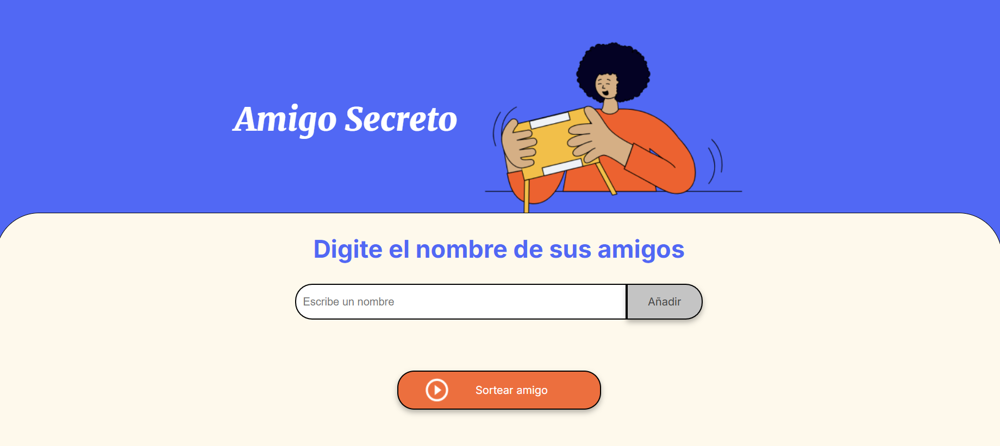

# 🎉 Challenge Amigo Secreto

¡Bienvenido al desafío que hará que tu próxima celebración sea inolvidable! 🥳

## 📌 Sobre el Proyecto

**Challenge Amigo Secreto** es una aplicación interactiva que lleva la emoción del tradicional juego de "Amigo Secreto" al mundo digital. Con una interfaz sencilla y amigable, permite gestionar la lista de participantes y realizar sorteos de manera justa y aleatoria.

✨ **¿Por qué este proyecto es especial?**
- Transforma una tradición en una experiencia más rápida y emocionante.
- Evita confusiones y errores en el sorteo.
- Perfecto para reuniones familiares, eventos de oficina o fiestas con amigos.

## 🚀 Características Clave
✅ **Agrega participantes** sin complicaciones.  
✅ **Sorteo 100% aleatorio** para garantizar transparencia.  
✅ **Interfaz intuitiva** y fácil de usar.  
✅ **Libre de papel** y ecológico.  
✅ ¡Y mucho más! 🎁

## 📷 Vista Previa


## 🔧 Tecnologías Utilizadas
💻 **HTML** - Para la estructura del proyecto.  
🎨 **CSS** - Para un diseño atractivo y responsivo.  
⚡ **JavaScript** - Para la lógica y dinamismo del sorteo.

## 📖 Cómo Usarlo
1️⃣ Clona este repositorio:  
   ```bash
   git clone https://github.com/DeibyMerchan/challenge-amigo-secreto.git
   ```
2️⃣ Abre `index.html` en tu navegador favorito.  
3️⃣ Agrega los nombres de los participantes.  
4️⃣ ¡Haz clic en el botón de sorteo y descubre a tu Amigo Secreto! 🎊

## 🌟 Contribuye y Mejora
¿Tienes ideas para mejorar esta aplicación? ¡Tu ayuda es bienvenida! 😊 Puedes:
- Reportar problemas y errores. 🐞
- Sugerir nuevas funcionalidades. 💡
- Enviar un Pull Request con mejoras. 🚀

## 📩 Contacto
Si te gustó este proyecto, no dudes en conectarte conmigo:
📧 **Correo:** [est.deibymerchan@gmail.com](mailto:est.deibymerchan@gmail.com)  
🔗 **LinkedIn:** [Deiby Merchan](https://www.linkedin.com/in/deiby-merchan-ayd/)  
🐙 **GitHub:** [DeibyMerchan](https://github.com/DeibyMerchan)

💙 ¡Gracias por apoyar este proyecto! Si te gustó, no olvides darle una ⭐ en GitHub y compartirlo con tus amigos. 🎁
